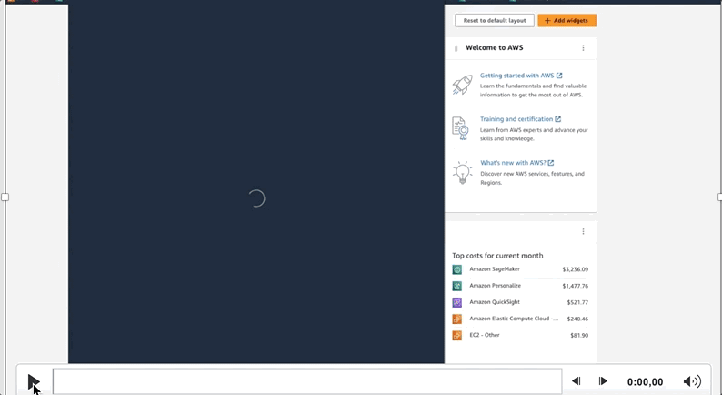
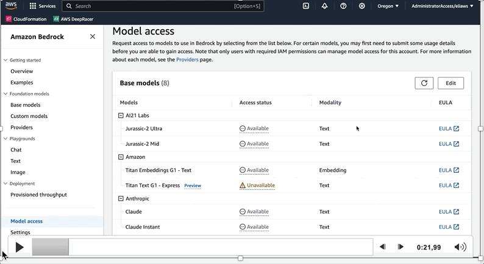
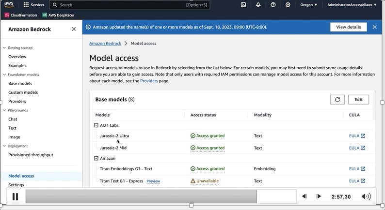

# [Amazon Bedrock](https://aws.amazon.com/es/bedrock/): Genai al alcance de una llamada de API. 

## Información general

Amazon Bedrock es un servicio totalmente administrado que permite que los modelos fundacionales (FM) de las principales startups de IA estén disponibles a través de una API, de modo que puede elegir entre varios modelos fundacionales para encontrar el que mejor se adapte a su caso de uso. Con la experiencia sin servidor de Amazon Bedrock, puede comenzar rápidamente, experimentar fácilmente con los modelos fundacionales, personalizarlos de forma privada con sus propios datos e integrarlos e implementarlos sin problemas en sus aplicaciones mediante las herramientas y capacidades de AWS. Los agentes para Amazon Bedrock están totalmente administrados y facilitan a los desarrolladores la creación de aplicaciones de inteligencia artificial generativa que pueden ofrecer respuestas actualizadas basadas en fuentes de conocimiento propias y completar tareas para una amplia gama de casos de uso.

> **Nota:** antes de empezar revisa su valor --> [Amazon Bedrock pricing](https://aws.amazon.com/es/bedrock/pricing/).

## Antes de empezar debes configurarlo en la consola. 

### Ingresa a la consola

### Accede a los modelos

### Listo para utilizar!

## Algunos enlaces para que pueda seguir aprendiendo y desarrollando:

- [Integrating Foundation Models into Your Code with Amazon Bedrock](https://www.youtube.com/watch?v=ab1mbj0acDo)

- [Amazon Bedrock Workshop](https://github.com/aws-samples/amazon-bedrock-workshop)

- [AWS Kendra LangChain Extensions](https://github.com/aws-samples/amazon-kendra-langchain-extensions/tree/main)

- [Prompt Engineering Techniques](https://www.promptingguide.ai/techniques)

- [Learn the fundamentals of generative AI for real-world applications](https://www.deeplearning.ai/courses/generative-ai-with-llms/)

- [LangChain for LLM Application Development](https://www.deeplearning.ai/short-courses/langchain-for-llm-application-development/)
