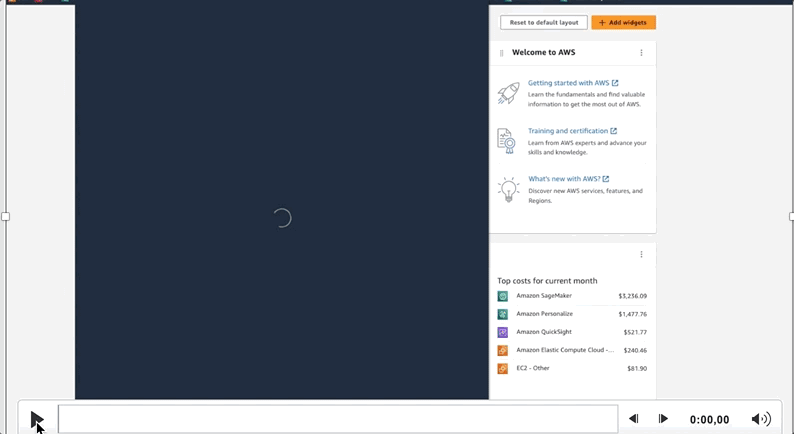
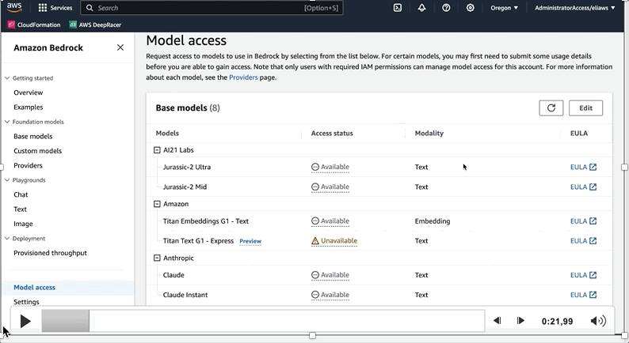
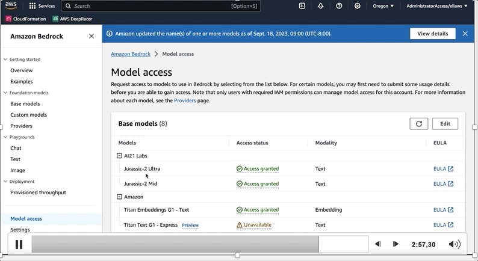

# Generative AI: Introducción a prompt engineering. 

> Más información en [Cómo elegir un LLM](https://dev.to/aws-espanol/como-elegir-un-llm-272o). 

El arte de crear un buen prompt se llama [prompt engineering](https://aws.amazon.com/what-is/prompt-engineering/). Es una disciplina con técnicas específicas para desarrollar y refinar las indicaciones que permiten que los modelos lingüísticos tengan resultados efectivos. La prompt engineering se centra en optimizar las indicaciones para obtener respuestas eficaces y útiles a partir de language models.

Con un prompt bien diseñado, las capacidades previamente entrenadas del modelo pueden aprovecharse para atender consultas novedosas dentro de su ámbito de aplicación. Dos de las técnicas de Prompt Engineer más conocidas son:

### Zero-shot Learning:

Para tareas que no requieren ejemplos previos para comprender el contexto de la tarea requerida. Por ejemplo, clasificación.

 Example of Zero-shot Learning.

### Few-shot Learning:

Las capacidades de Zero-shot se refieren a la capacidad de los LLM para completar tareas en las que no los entrenaron. Sin embargo, siguen teniendo limitaciones a la hora de realizar tareas complejas con solo un breve aviso inicial sin orientación. Few-Shot Learning mejora el rendimiento de los modelos en tareas difíciles mediante la incorporación de demostraciones o el aprendizaje en contexto.

>📚 **Tip:** Entregale al LLM el contexto de cuál es su función, por ejemplo: «Eres un asistente de viajes».

 Example of Few-shot Learning.

Obtenga más información sobre prompt engineering: 

- [What is prompt engineering?](https://aws.amazon.com/what-is/prompt-engineering/)

- [Prompt engineering for foundation models](https://docs.aws.amazon.com/sagemaker/latest/dg/jumpstart-foundation-models-customize-prompt-engineering.html)

- [Prompt Engineering Guide](https://www.promptingguide.ai/)

- [Guide to Anthropic's prompt engineering resources](https://docs.anthropic.com/claude/docs)

- [Prompt Engineering for Developers: How AI Can Help With Architecture Decisions](https://community.aws/posts/prompt-engineering-for-developers/how-ai-can-help-with-architecture-decisions)

- [Fun on a Friday with Prompt Engineering and thinking about re:Invent 2023](https://community.aws/posts/friday-fun-style-changing-reinvent-guide)


## Información general para usar los Notebooks

Amazon Bedrock es un servicio totalmente administrado que permite que los modelos fundacionales (FM) de las principales startups de IA estén disponibles a través de una API, de modo que puede elegir entre varios modelos fundacionales para encontrar el que mejor se adapte a su caso de uso. Con la experiencia sin servidor de Amazon Bedrock, puede comenzar rápidamente, experimentar fácilmente con los modelos fundacionales, personalizarlos de forma privada con sus propios datos e integrarlos e implementarlos sin problemas en sus aplicaciones mediante las herramientas y capacidades de AWS. Los agentes para Amazon Bedrock están totalmente administrados y facilitan a los desarrolladores la creación de aplicaciones de inteligencia artificial generativa que pueden ofrecer respuestas actualizadas basadas en fuentes de conocimiento propias y completar tareas para una amplia gama de casos de uso.

> **Nota:** antes de empezar revisa su valor --> [Amazon Bedrock pricing](https://aws.amazon.com/es/bedrock/pricing/).


## Antes de empezar debes configurarlo en la consola. 

### Crea una Cuenta gratuita

- [Crear cuenta](https://aws.amazon.com/es/free/)

> **Nota:** AWS tiene una capa gratuita para varios de sus servicios, revisa cuales estan dentro de esa capa gratiuta [aca](https://aws.amazon.com/es/free/). Ten en cuenta que [Amazon Bedrock](https://aws.amazon.com/es/bedrock/pricing/) no esta dentro de esa capa gratuita.

### Ingresa a la consola



### Accede a los modelos



### Listo para utilizar!



### Como usar Amazon Bedrock como una llamada de API empleando el [AWS SDK para Python](https://aws.amazon.com/es/sdk-for-python/).

- Instala la libreria de Boto3.

```python
pip install boto3  
``` 
- Aprende más de las [API con boto3](https://boto3.amazonaws.com/v1/documentation/api/latest/guide/resources.html). 

- Instala la AWS Linea de Comandos (CLI) en tu computador. 

Sigue los pasos en [este link](https://aws.amazon.com/es/cli/). 

## Algunos enlaces para que pueda seguir aprendiendo y desarrollando:

- [Incorpora IA generativa a una aplicación web de JavaScript](https://community.aws/content/2cPcmjVFETxNNLUm1LNkqSOHasu/building-reactjs-generative-ai-apps-with-amazon-bedrock-and-aws-javascript-sdk?lang=es-ES)
- [Integrating Foundation Models into Your Code with Amazon Bedrock](https://www.youtube.com/watch?v=ab1mbj0acDo)

- [Amazon Bedrock Workshop](https://github.com/aws-samples/amazon-bedrock-workshop)

- [AWS Kendra LangChain Extensions](https://github.com/aws-samples/amazon-kendra-langchain-extensions/tree/main)

- [Prompt Engineering Techniques](https://www.promptingguide.ai/techniques)

- [Learn the fundamentals of generative AI for real-world applications](https://www.deeplearning.ai/courses/generative-ai-with-llms/)

- [LangChain for LLM Application Development](https://www.deeplearning.ai/short-courses/langchain-for-llm-application-development/)

- [Working With Your Live Data Using LangChain](https://community.aws/posts/working-with-your-live-data-using-langchain)